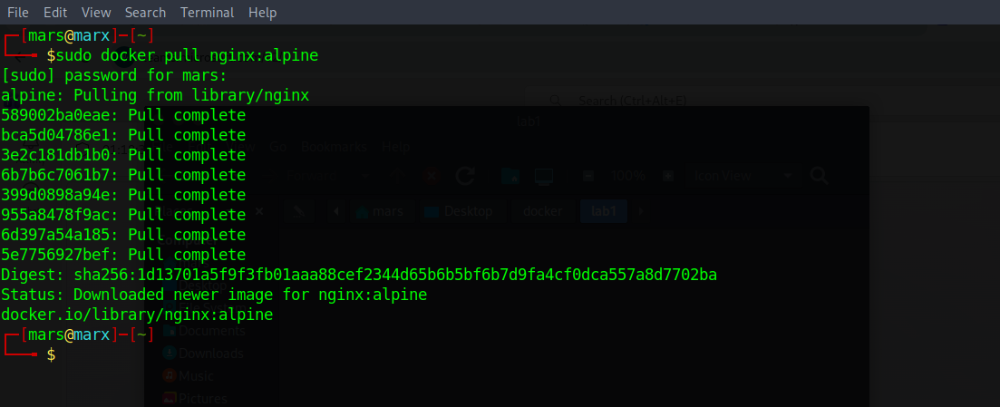
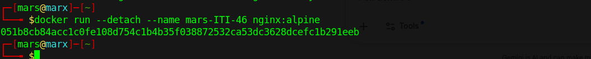
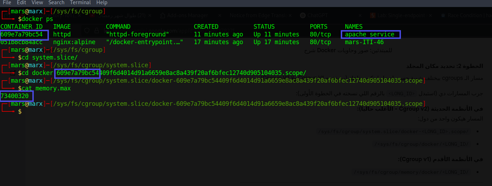

# Docker Lab: Container Management and Resource Constraints

This repository demonstrates the fundamental operations of Docker, focusing on image management, container deployment with custom naming, and enforcing hardware resource limits (CPU/Memory) using Linux Control Groups (cgroups).

---

## Task Overview
The objective of this lab is to:
1. Pull and manage Docker images.
2. Deploy containers with specific configurations (Detached mode & Custom naming).
3. Implement and verify resource constraints at the OS level (cgroups).

---

## Implementation & Command Reference

### 1. Pulling the Nginx Alpine Image
To get the lightweight version of Nginx, the `alpine` tag was used to minimize disk footprint.
* **Command:** ```bash
    sudo docker pull nginx:alpine
    ```
* **Explanation:** This fetches the image layers from Docker Hub to the local machine.



---

### 2. Deploying a Named Container in Background
The container was started in the background to keep the terminal session active.
* **Command:**
    ```bash
    docker run --detach --name mars-ITI-46 nginx:alpine
    ```
* **Key Flags:**
    * `--detach` (or `-d`): Runs the container in the background.
    * `--name`: Assigns a specific identity (`mars-ITI-46`) instead of a random Docker name.



---

### 3. Resource-Limited Apache Service
This step ensures that the `httpd` (Apache) container does not consume all host resources.
* **Command:**
    ```bash
    docker run -d --name apache_service --memory="70m" --cpus="1" httpd
    ```
* **Key Flags:**
    * `--memory="70m"`: Hard limit for RAM. The container cannot exceed 70MB.
    * `--cpus="1"`: Limits the container to a maximum of one CPU core.


---

### 4. Verification via Linux cgroups
To prove that Docker actually communicates with the Linux Kernel, we inspected the `cgroups` (Control Groups) filesystem.
* **Commands used for verification:**
    ```bash
    # Navigate to the docker control group
    cd /sys/fs/cgroup/system.slice/docker-<CONTAINER_ID>.scope/
    
    # Check the memory limit
    cat memory.max
    ```
* **Result:** The value `73400320` was found. 
* **Math:** $70 \times 1024 \times 1024 = 73,400,320$ bytes. This confirms the 70MB limit is active at the kernel level.



---

## Technical Environment
* **OS:** Linux (cgroups v2 enabled)
* **Container Engine:** Docker
* **Images:** `nginx:alpine`, `httpd:latest`
