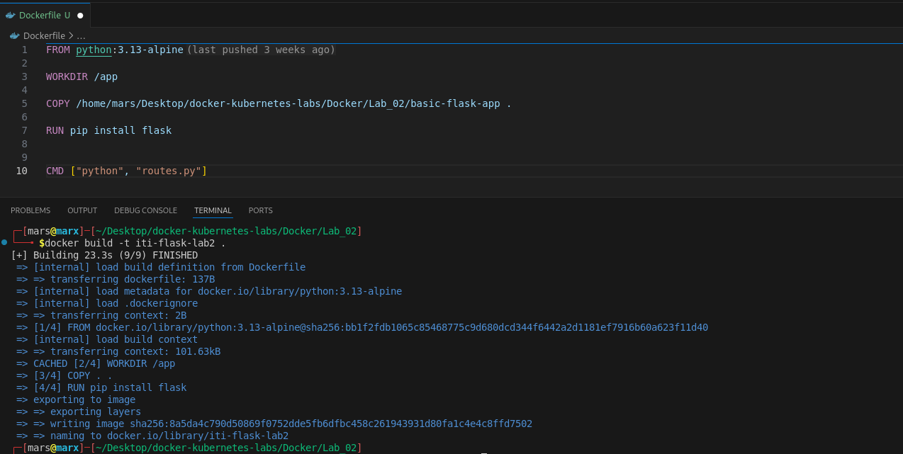
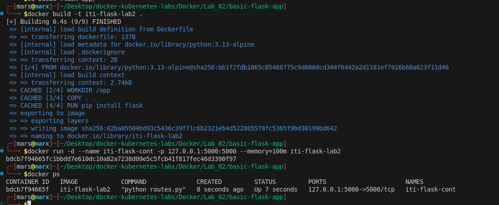
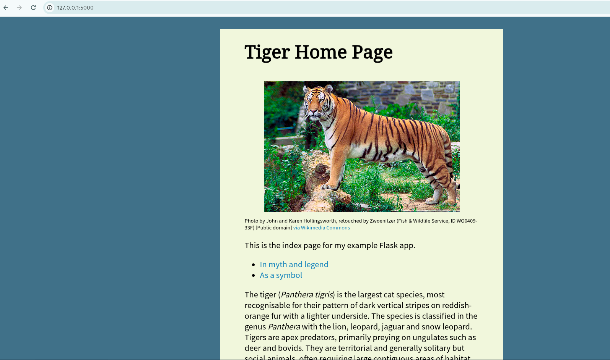
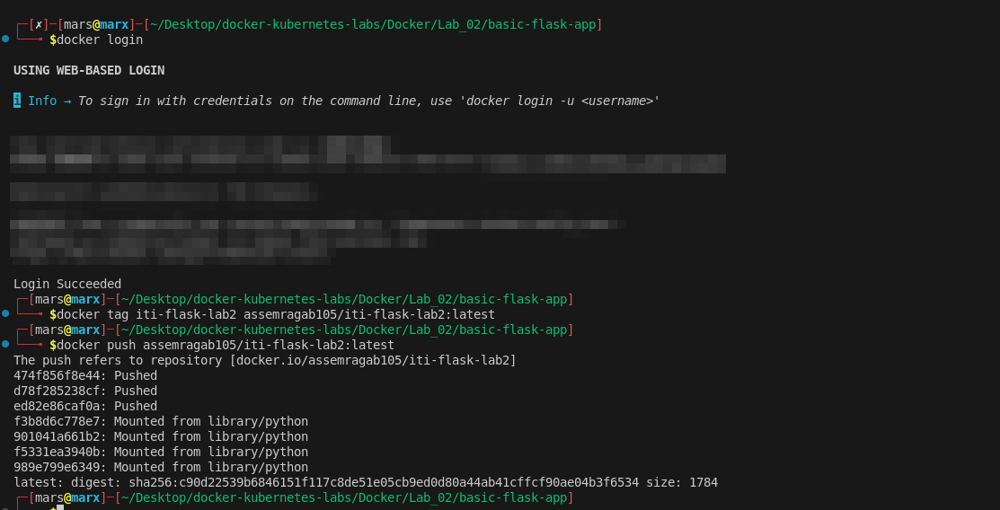
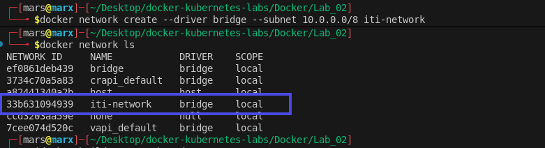
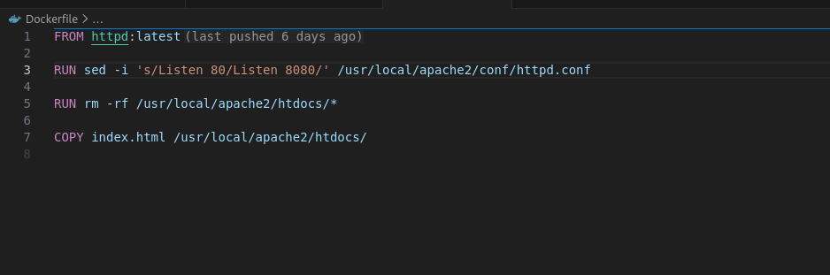
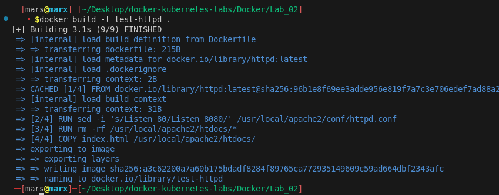
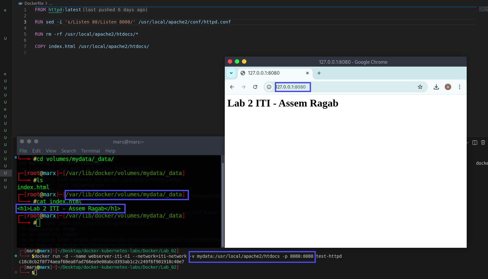

# Lab 2: Dockerizing Applications, Custom Networking, and Persistence

This lab is divided into two main tasks focusing on building custom Docker images, managing a private registry (Docker Hub), configuring advanced networking, and implementing persistent storage using Volumes.

---

## Task 1: Building and Deploying a Flask Application

### Objectives:
1. Create a `Dockerfile` for a Python Flask application.
2. Build the image with a custom tag.
3. Run the container with a **100MB memory limit**.
4. Push the final image to a personal **Docker Hub** repository.

### Implementation Steps:

* **Step 1: Containerization (Dockerfile)**
    The application uses `python:3.13-alpine` to keep the image lightweight. The `Dockerfile` handles dependency installation and sets the entry point for the Flask app.
    

* **Step 2: Build & Local Execution**
    The image was built as `iti-flask-lab2`. During deployment, port **5000** was mapped to the host, and a memory constraint was applied.
    ```bash
    docker build -t iti-flask-lab2 .
    docker run -d --name iti-flask-cont -p 127.0.0.1:5000:5000 --memory=100m iti-flask-lab2
    ```
    

* **Step 3: Verification (PoC)**
    Testing the application via the local browser to ensure the Flask routes are serving the correct content.
    

* **Step 4: Docker Hub Registry**
    The image was tagged and pushed to the cloud registry for remote accessibility.
    ```bash
    docker login
    docker tag iti-flask-lab2 assemragab105/iti-flask-lab2:latest
    docker push assemragab105/iti-flask-lab2:latest
    ```
    

---

## Task 2: Custom Networking & Apache Volume Integration

### Objectives:
1. Create a custom **Bridge Network** with a specific subnet.
2. Develop a `Dockerfile` for an **Apache (httpd)** server.
3. Modify the server configuration (Port 80 to 8080).
4. Implement **Docker Volumes** for persistent web content.

### Implementation Steps:

* **Step 1: Network & Volume Creation**
    A new bridge network named `iti-network` was created with the subnet `10.0.0.0/8`. A named volume `mydata` was also initialized.
    ```bash
    docker network create --driver bridge --subnet 10.0.0.0/8 iti-network
    ```
    

* **Step 2: Customizing Apache (Dockerfile)**
    The `httpd` configuration was modified using `sed` to change the listening port to **8080**, and a custom `index.html` was injected.
    

* **Step 3: Building & Linking**
    The image was built and then executed within the custom network while mounting the volume.
    ```bash
    docker build -t test-httpd .
    docker run -d --name webserver-iti-n1 --network=iti-network -v mydata:/usr/local/apache2/htdocs -p 8080:8080 test-httpd
    ```
    

* **Step 4: Persistence Verification**
    Confirming that the data exists in the volume path on the host and checking the live web page.
    * **Path:** `/var/lib/docker/volumes/mydata/_data/index.html`
    

---

## Environment Summary
* **Base Images:** `python:3.13-alpine`, `httpd:latest`
* **Key Features:** Memory Limits, Port Forwarding, Docker Hub Integration, Custom Subnets, Named Volumes.
