# Lab 3

This repository contains the setup and deployment steps for Lab 3, divided into three main sections: configuring a local insecure Docker registry, setting up WordPress with Docker Compose, and deploying a Flask application with an Nginx reverse proxy.

---

## Part 1: Insecure Docker Registry and Custom Image

In this section, we set up a local, insecure Docker registry, build a custom Nginx image based on Alpine Linux, and push the newly created image to our local registry.

**1. Creating the Dockerfile**
Created a custom `Dockerfile` using `alpine:latest` as the base image and instructed it to install and run Nginx.
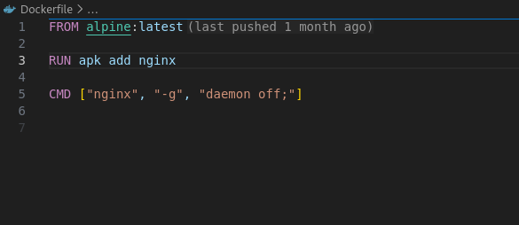

**2. Building the Image**
Built the Docker image locally using the Dockerfile and tagged it as `nginx-alpine`.
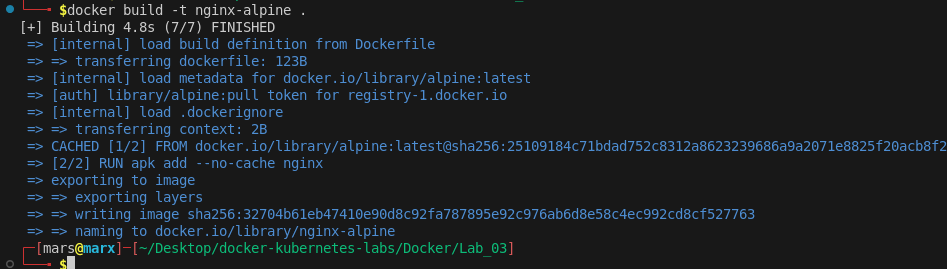

**3. Configuring the Insecure Registry**
Configured the Docker daemon to allow insecure registries by modifying `/etc/docker/daemon.json` to include `localhost:5000`, then restarted the Docker service.
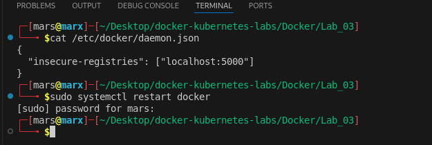

**4. Running the Local Registry**
Pulled the official `registry:2` image and ran it as a background container mapped to port 5000 on the host.
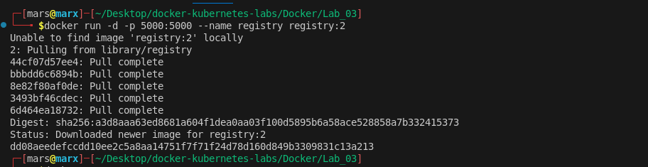

**5. Tagging and Pushing the Image**
Tagged the built `nginx-alpine` image to match the localhost registry URL and pushed it. The push was verified by querying the registry's `_catalog` endpoint via `curl`.
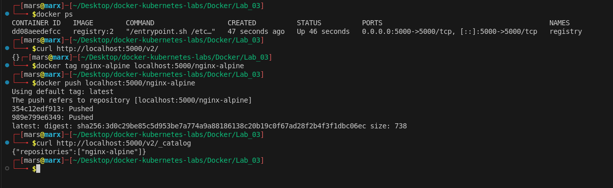

---

## Part 2: Docker Compose Setup

This section demonstrates how to deploy a multi-container application (WordPress and MySQL) using Docker Compose with persistent volume mounts.

**1. Docker Compose Configuration**
Created a `docker-compose.yml` file defining two services: a `db` service using `mysql:5.7` and a `wordpress` service using `wordpress:latest`. Volumes were mapped to the host to persist database and website data, and WordPress was exposed on port 8080.
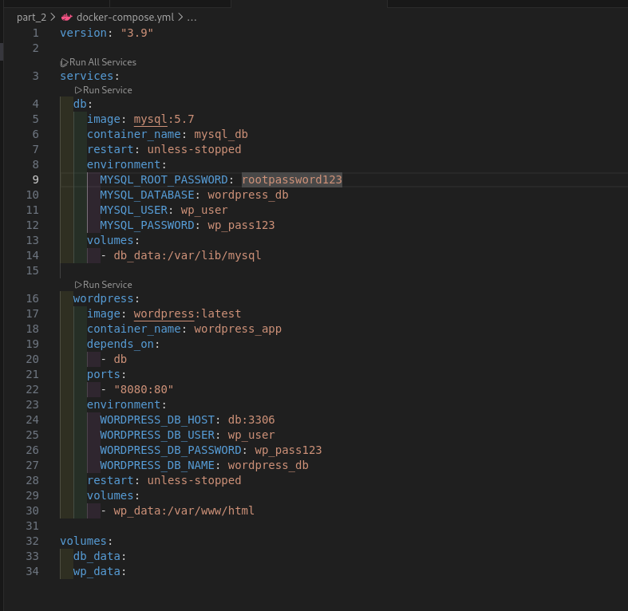

**2. Bringing Up the Services**
Ran `docker compose up -d` to pull the required images, create the network and volumes, and start the containers. Verified the running services and port mappings using `docker compose ps`.
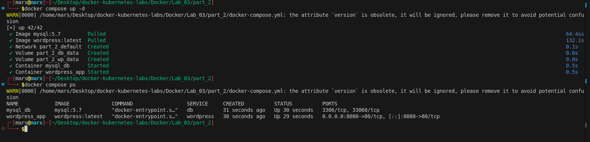

**3. Verifying WordPress Deployment**
Accessed the WordPress web interface on `localhost:8080` to confirm the application was successfully running and connected to the backend database.
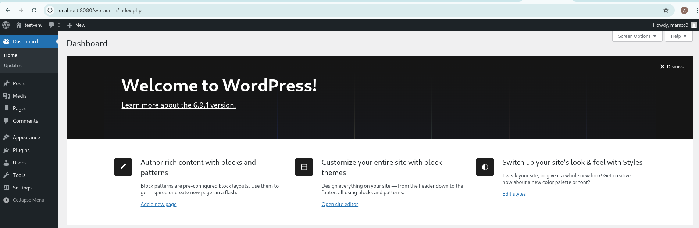

---

## Part 3: Nginx Reverse Proxy / Deployment

In this bonus section, we push a Flask application to the private registry and deploy it using Docker Compose, placing an Nginx reverse proxy in front of it.

**1. Pushing the Flask Image**
Tagged the `iti-flask-lab2` image (created in a previous lab) and pushed it to the private local registry (`localhost:5000`). Verified that both the Flask app and the previously pushed Nginx image are present in the registry catalog.
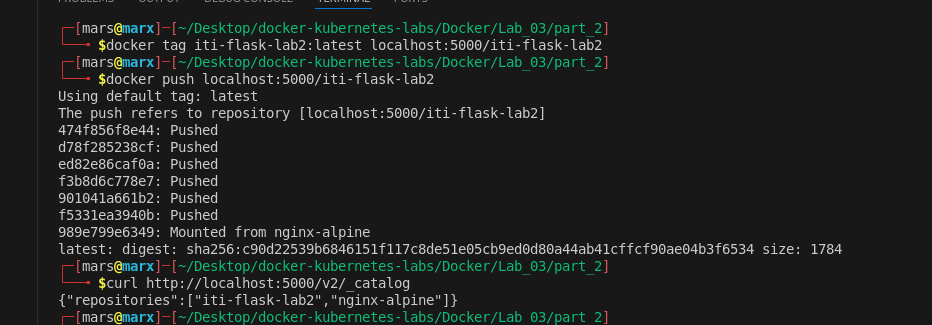

**2. Nginx Configuration**
Created an `nginx.conf` file to configure Nginx as a reverse proxy. It listens on port 80 inside the container and forwards incoming traffic to the `flask:5000` backend service.
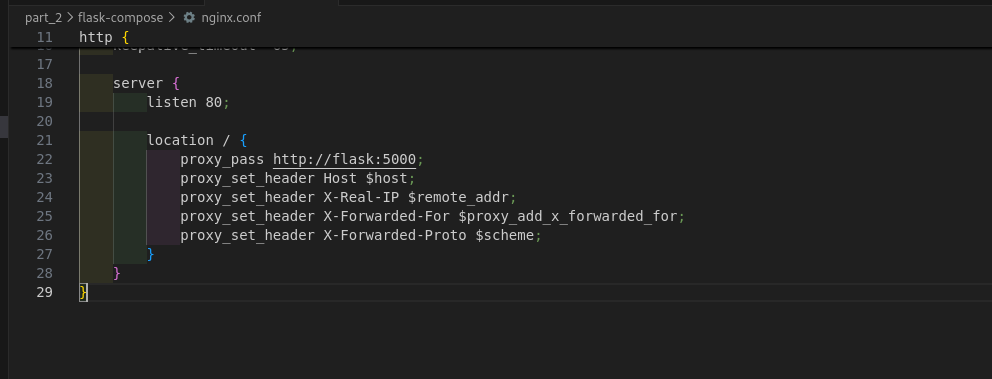

**3. Running Services with Docker Compose**
Configured a new `docker-compose.yml` to run the `flask` application (pulled from the local registry) and the `nginx` reverse proxy. The Nginx service maps host port 8081 to container port 80 and mounts the custom `nginx.conf` as a read-only volume.
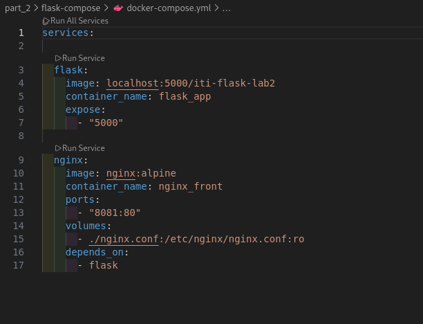

**4. Verifying the Setup**
Ran `docker compose up -d` to start the application stack. Verified that both `flask_app` and `nginx_front` containers are running and mapped to the correct ports using `docker ps -a`.
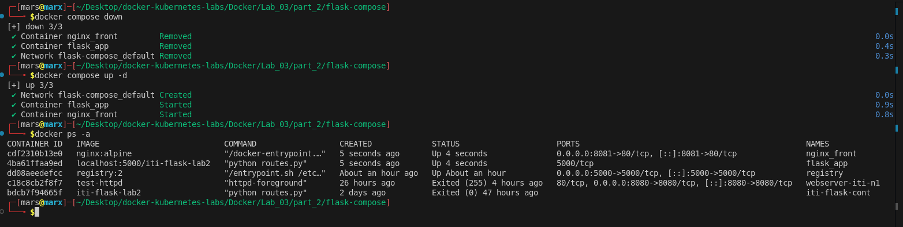

**5. Proof of Concept**
Successfully accessed the application through the host to confirm that the Nginx reverse proxy correctly routes incoming traffic to the backend Flask application.

