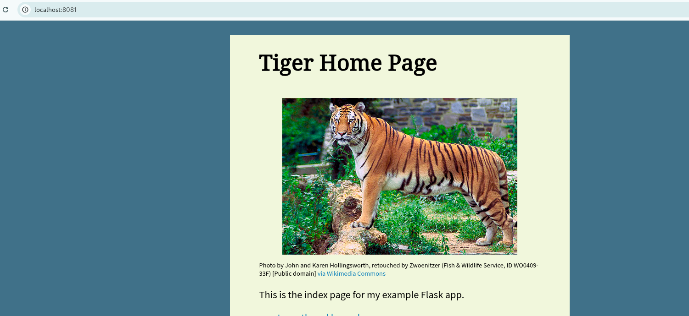

# Lab 3

This repository contains the setup and deployment steps for Lab 3, divided into three main sections: configuring a local insecure Docker registry, setting up WordPress with Docker Compose, and deploying a Flask application with an Nginx reverse proxy.

---

## Part 1: Insecure Docker Registry and Custom Image

In this section, we set up a local, insecure Docker registry, build a custom Nginx image based on Alpine Linux, and push the newly created image to our local registry.

**1. Creating the Dockerfile**
Created a custom `Dockerfile` using `alpine:latest` as the base image and instructed it to install and run Nginx.

  

**2. Building the Image**
Built the Docker image locally using the Dockerfile and tagged it as `nginx-alpine`.

  

**3. Configuring the Insecure Registry**
Configured the Docker daemon to allow insecure registries by modifying `/etc/docker/daemon.json` to include `localhost:5000`, then restarted the Docker service.

  

**4. Running the Local Registry**
Pulled the official `registry:2` image and ran it as a background container mapped to port 5000 on the host.

  

**5. Tagging and Pushing the Image**
Tagged the built `nginx-alpine` image to match the localhost registry URL and pushed it. The push was verified by querying the registry's `_catalog` endpoint via `curl`.

  

---

## Part 2: Docker Compose Setup

This section demonstrates how to deploy a multi-container application (WordPress and MySQL) using Docker Compose with persistent volume mounts.

**1. Docker Compose Configuration**
Created a `docker-compose.yml` file defining two services: a `db` service using `mysql:5.7` and a `wordpress` service using `wordpress:latest`. Volumes were mapped to the host to persist database and website data, and WordPress was exposed on port 8080.

  

**2. Bringing Up the Services**
Ran `docker compose up -d` to pull the required images, create the network and volumes, and start the containers. Verified the running services and port mappings using `docker compose ps`.

**3. Verifying WordPress Deployment**
Accessed the WordPress web interface on `localhost:8080` to confirm the application was successfully running and connected to the backend database.

---

## Part 3: Nginx Reverse Proxy / Deployment

In this bonus section, we pull a Flask application from the private registry and deploy it using Docker Compose, placing an Nginx reverse proxy in front of it.

**1. Nginx Configuration**
Set up the Nginx configuration to act as a reverse proxy, routing incoming traffic on port 80 to the backend Flask application running on port 8080.

**2. Docker Compose Execution**
Executed the Docker Compose file to orchestrate the backend application (pulled from the local registry) and the Nginx proxy container.

**3. Starting and Verifying Services**
Started the environment and verified that all containers are up, correctly linked, and exposing the proper ports to the host.

**4. Proof of Concept (PoC)**
Tested the deployment by accessing the application via the Nginx reverse proxy on port 80 to ensure traffic is correctly routed to the backend.

**5. Pushing the Final Configurations**
Pushed the final required images to the registry to complete the lab requirements.

