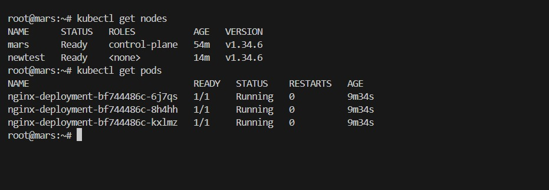
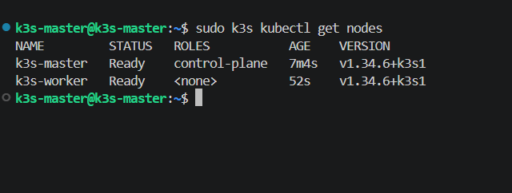

# Lab 01 - kubeadm (1 Controlplane + 1 Worker) + bonus k3s

This lab documents a kubeadm setup with one controlplane and one worker node using Flannel CNI. It also includes the bonus k3s setup (1 server + 1 agent). Replace placeholders like `CONTROLPLANE_IP` and `WORKER_IP` with your actual values.

## Environment

- Controlplane node: `CONTROLPLANE_IP`
- Worker node: `WORKER_IP`
- OS/Version: `YOUR_OS_VERSION`
- SSH user: `YOUR_SSH_USER`
- Kubernetes version: `v1.34.6`

## kubeadm Installation (from gist)

Reference: https://gist.github.com/galal-hussein/96ac1b9094198094dfea0a04f145c009

### 1) Install kubelet, kubectl, kubeadm

```bash
sudo apt install curl apt-transport-https -y
curl -fsSL https://pkgs.k8s.io/core:/stable:/v1.34/deb/Release.key | sudo gpg --dearmor -o /etc/apt/keyrings/kubernetes-apt-keyring.gpg
echo 'deb [signed-by=/etc/apt/keyrings/kubernetes-apt-keyring.gpg] https://pkgs.k8s.io/core:/stable:/v1.34/deb/ /' | sudo tee /etc/apt/sources.list.d/kubernetes.list

sudo apt update
sudo apt install wget curl vim git kubelet kubeadm kubectl -y
sudo apt-mark hold kubelet kubeadm kubectl

sudo swapoff -a
```

### 2) Install containerd

Configure persistent loading of modules:

```bash
sudo tee /etc/modules-load.d/k8s.conf <<EOF
overlay
br_netfilter
EOF
```

Load at runtime:

```bash
sudo modprobe overlay
sudo modprobe br_netfilter
```

Ensure sysctl params are set:

```bash
sudo tee /etc/sysctl.d/kubernetes.conf<<EOF
net.bridge.bridge-nf-call-ip6tables = 1
net.bridge.bridge-nf-call-iptables = 1
net.ipv4.ip_forward = 1
EOF
```

Reload configs:

```bash
sudo sysctl --system
```

Install required packages:

```bash
sudo apt install -y curl gnupg2 software-properties-common apt-transport-https ca-certificates
```

Add Docker repo:

```bash
curl -fsSL https://download.docker.com/linux/ubuntu/gpg | sudo apt-key add -
sudo add-apt-repository "deb [arch=amd64] https://download.docker.com/linux/ubuntu $(lsb_release -cs) stable"
```

Install containerd:

```bash
sudo apt update
sudo apt install -y containerd.io
```

Configure containerd and start service:

```bash
sudo su -
mkdir -p /etc/containerd
sudo tee /etc/containerd/config.toml<<EOF
version = 2
[plugins]
  [plugins."io.containerd.grpc.v1.cri"]
   [plugins."io.containerd.grpc.v1.cri".containerd]
      [plugins."io.containerd.grpc.v1.cri".containerd.runtimes]
        [plugins."io.containerd.grpc.v1.cri".containerd.runtimes.runc]
          runtime_type = "io.containerd.runc.v2"
          [plugins."io.containerd.grpc.v1.cri".containerd.runtimes.runc.options]
            SystemdCgroup = true
EOF

sudo systemctl restart containerd
sudo systemctl enable containerd
systemctl status containerd
```

### 3) Configure kubeadm

```bash
sudo tee ~/kubeadm.yaml<<EOF
kind: ClusterConfiguration
apiVersion: kubeadm.k8s.io/v1beta3
kubernetesVersion: v1.34.6
controlPlaneEndpoint: CONTROLPLANE_IP
networking:
  podSubnet: "10.244.0.0/16"
---
kind: KubeletConfiguration
apiVersion: kubelet.config.k8s.io/v1beta1
cgroupDriver: systemd
EOF
```

### 4) Start kubeadm (controlplane)

```bash
sudo kubeadm init --config kubeadm.yaml
```

Configure kubectl on the controlplane:

```bash
mkdir -p $HOME/.kube
sudo cp -i /etc/kubernetes/admin.conf $HOME/.kube/config
sudo chown $(id -u):$(id -g) $HOME/.kube/config
```

### 5) Install Flannel CNI

```bash
kubectl apply -f https://github.com/flannel-io/flannel/releases/latest/download/kube-flannel.yml
```

### 6) Join the worker node

Use the join command from the controlplane output:

```bash
sudo kubeadm join CONTROLPLANE_IP:6443 --token TOKEN --discovery-token-ca-cert-hash sha256:HASH
```

### 7) Verify nodes are Ready

```bash
kubectl get nodes -o wide
```

## Deployment (run on kubeadm cluster)

Create the deployment manifest:

```yaml
apiVersion: apps/v1
kind: Deployment
metadata:
  name: nginx-deployment
  labels:
    app: nginx
spec:
  replicas: 3
  selector:
    matchLabels:
      app: nginx
  template:
    metadata:
      labels:
        app: nginx
    spec:
      containers:
      - name: nginx
        image: nginx:1.14.2
        ports:
        - containerPort: 80
```

Apply it:

```bash
kubectl apply -f nginx-deployment.yaml
kubectl get pods -o wide
```

## Bonus: k3s (1 server + 1 agent)

### 1) Install k3s on the server

```bash
curl -sfL https://get.k3s.io | sh -
```

Verify server is up:

```bash
sudo k3s kubectl get nodes
```

### 2) Get the server join token

```bash
sudo cat /var/lib/rancher/k3s/server/node-token
```

### 3) Install k3s on the agent node

```bash
curl -sfL https://get.k3s.io | K3S_URL=https://CONTROLPLANE_IP:6443 K3S_TOKEN=YOUR_NODE_TOKEN sh -
```

### 4) Verify nodes are Ready

```bash
sudo k3s kubectl get nodes -o wide
```

## Screenshots

Add your kubeadm and deployment proof here:



Add your k3s proof here once uploaded:


