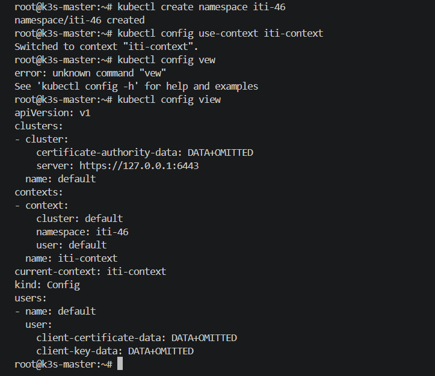
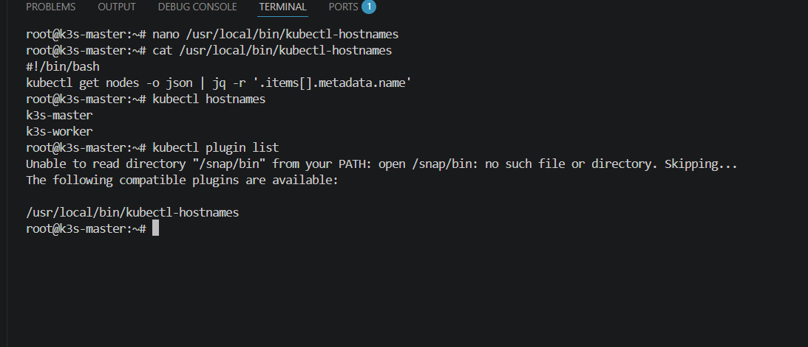
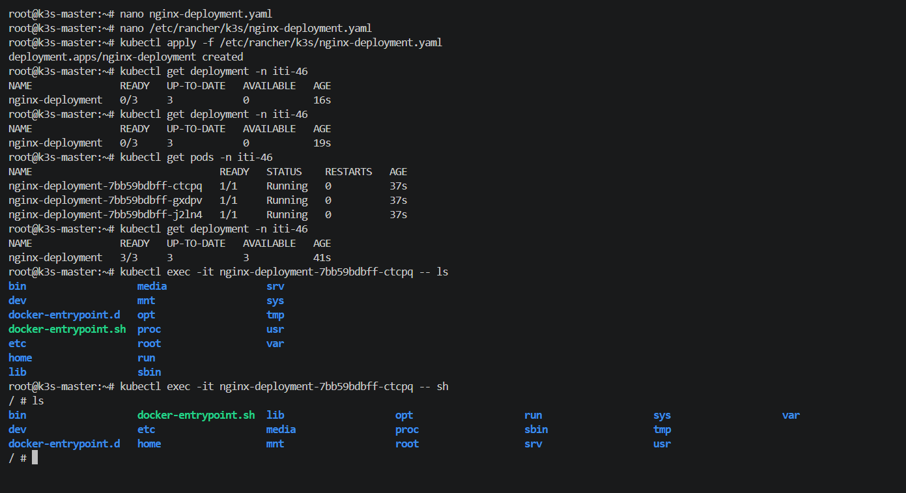

# Lab 02 - kubectl config, plugin, and deployment (k3s)

This lab documents a k3s cluster with one server and one agent node, kubectl context configuration, a kubectl plugin, and a deployment.

If you want a shorter apply file for the namespace and deployment, use `lab-02-simple.yaml`.

## 1) Create k3s cluster (1 server + 1 agent)

### Server node

```bash
curl -sfL https://get.k3s.io | sh -
kubectl get nodes
sudo cat /var/lib/rancher/k3s/server/node-token
```

### Agent node

```bash
curl -sfL https://get.k3s.io | K3S_URL=https://SERVER_IP:6443 K3S_TOKEN=NODE_TOKEN sh -
```

### Verify nodes

```bash
kubectl get nodes -o wide
```

## 2) Create namespace iti-46

```bash
kubectl create namespace iti-46
kubectl get ns
```

## 3) Add kubectl context iti-context with namespace iti-46

```bash
kubectl config get-contexts
kubectl config set-context iti-context -n iti-46
kubectl config use-context iti-context
kubectl config view --minify
```

## 4) Create kubectl plugin: kubectl hostnames

Create an executable file named `kubectl-hostnames` in your PATH (example: `/usr/local/bin`):

```bash
#!/usr/bin/env bash
kubectl get nodes -o jsonpath='{range .items[*]}{.metadata.name}{"\n"}{end}'
```

Then:

```bash
chmod +x /usr/local/bin/kubectl-hostnames
kubectl hostnames
```

## 5) Deployment (3 replicas, nginx:alpine, env FOO=ITI)

Create `deployment.yaml`:

```yaml
apiVersion: apps/v1
kind: Deployment
metadata:
  name: nginx-alpine-deployment
  namespace: iti-46
spec:
  replicas: 3
  selector:
    matchLabels:
      app: nginx-alpine
  template:
    metadata:
      labels:
        app: nginx-alpine
    spec:
      containers:
      - name: nginx
        image: nginx:alpine
        env:
        - name: FOO
          value: ITI
        ports:
        - containerPort: 80
```

Apply and verify:

```bash
kubectl apply -f deployment.yaml
kubectl get deploy -n iti-46
kubectl get pods -n iti-46 -o wide
```

## 6) Bash auto-completion

```bash
kubectl completion bash >> ~/.bashrc
source ~/.bashrc
```

## Screenshots (PoC)




