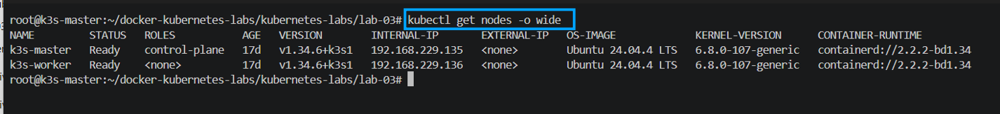
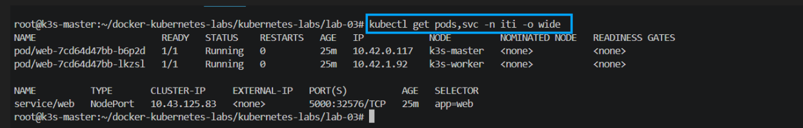
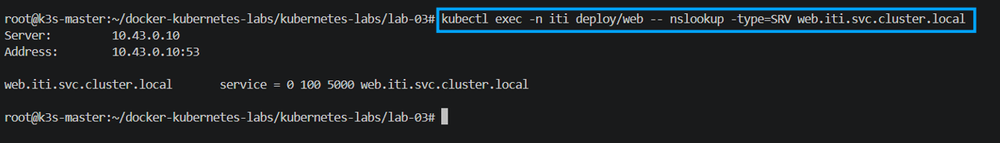
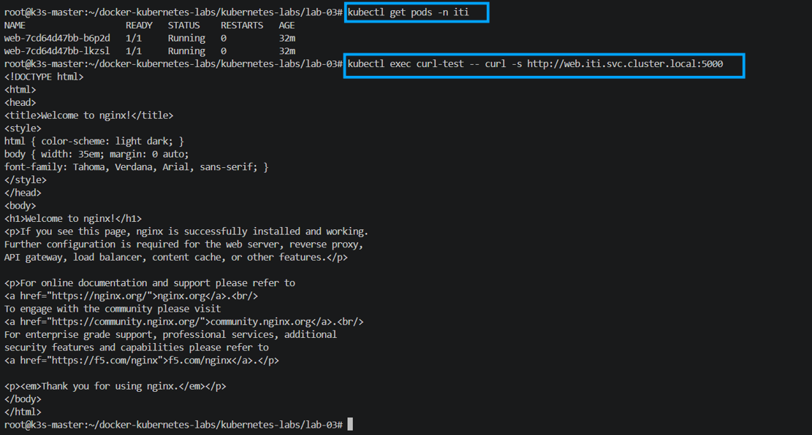
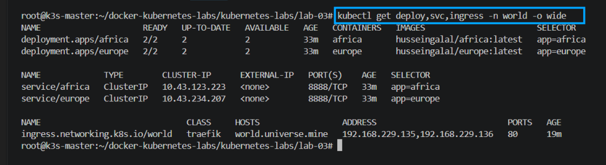
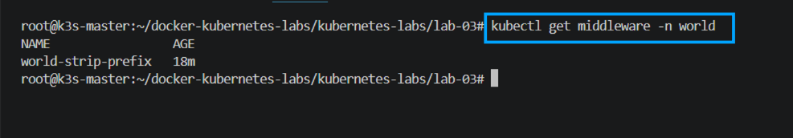
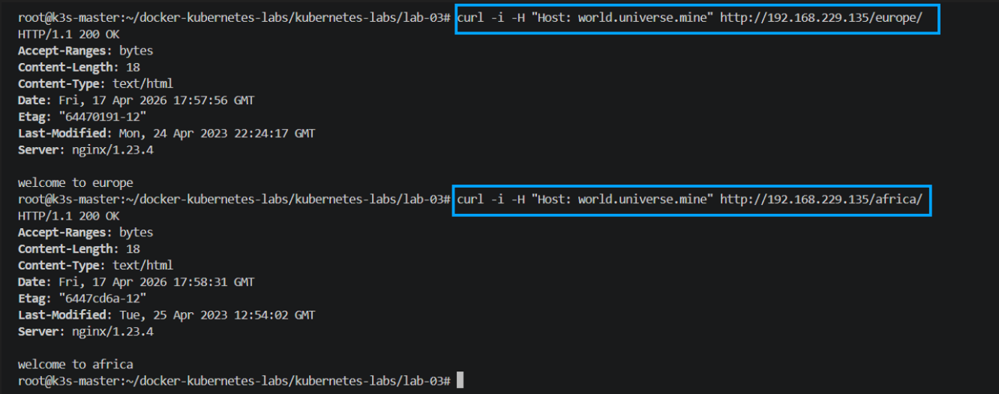

# Lab 03 - DNS, Services, and Ingress

This lab was implemented on a k3s cluster and verified with live commands.

## Environment

- Controlplane: `192.168.229.135`
- Worker: `192.168.229.136`
- Kubernetes: `v1.34.6+k3s1`

## Task 1 - DNS (10 points)

### 1) Create deployment `web` in namespace `iti` with 2 replicas

```bash
kubectl create namespace iti
kubectl create deployment web --image=nginx:alpine -n iti --replicas=2 --port=80
```

PoC:



### 2) Create NodePort service on port 5000

```bash
kubectl expose deployment web -n iti --type=NodePort --name=web --port=5000 --target-port=80
kubectl get pods,svc -n iti -o wide
```

PoC:



### 3) Check SRV record for the service

For SRV records, the service port must be named. The service was patched with port name `http`.

```bash
kubectl patch svc web -n iti -p '{"spec":{"ports":[{"name":"http","port":5000,"protocol":"TCP","targetPort":80,"nodePort":32576}]}}'
kubectl exec -n iti deploy/web -- nslookup -type=SRV _http._tcp.web.iti.svc.cluster.local
```

PoC:



### 4) Create test pod in default namespace and curl service by DNS

```bash
kubectl run curl-test --image=curlimages/curl:latest --restart=Never -- sleep 3600
kubectl wait --for=condition=Ready pod/curl-test --timeout=60s
kubectl exec curl-test -- curl -s http://web.iti.svc.cluster.local:5000
```

PoC:



## Task 2 - Ingress and Services (15 points)

### 1) Create required namespaces

```bash
kubectl create namespace iti-45
kubectl create namespace world
```

PoC:



### 2) Create deployments in `world` namespace

```bash
kubectl create deployment africa --image=husseingalal/africa:latest -n world --replicas=2
kubectl create deployment europe --image=husseingalal/europe:latest -n world --replicas=2
```

### 3) Expose deployments as ClusterIP services

```bash
kubectl expose deployment africa -n world --name=africa --port=8888 --target-port=80
kubectl expose deployment europe -n world --name=europe --port=8888 --target-port=80
kubectl get deploy,svc -n world -o wide
```

PoC:



### 4) Add DNS mapping on the client machine

```bash
sudo sh -c 'echo "192.168.229.135 world.universe.mine" >> /etc/hosts'
```

### 5) Create Ingress `world`

File: `world-ingress.yaml`

```yaml
apiVersion: networking.k8s.io/v1
kind: Ingress
metadata:
  name: world
  namespace: world
  annotations:
    traefik.ingress.kubernetes.io/router.middlewares: world-world-strip-prefix@kubernetescrd
spec:
  rules:
  - host: world.universe.mine
    http:
      paths:
      - path: /europe
        pathType: Prefix
        backend:
          service:
            name: europe
            port:
              number: 8888
      - path: /africa
        pathType: Prefix
        backend:
          service:
            name: africa
            port:
              number: 8888
---
apiVersion: traefik.io/v1alpha1
kind: Middleware
metadata:
  name: world-strip-prefix
  namespace: world
spec:
  stripPrefix:
    prefixes:
      - /europe
      - /africa
```

```bash
kubectl apply -f world-ingress.yaml
kubectl get ingress,middleware -n world
```

### 6) Test routes

```bash
curl -i -H "Host: world.universe.mine" http://192.168.229.135/europe/
curl -i -H "Host: world.universe.mine" http://192.168.229.135/africa/
```

PoC:



Expected responses:

- Europe: `welcome to europe`
- Africa: `welcome to africa`

## Notes

- If `nslookup` returns `NXDOMAIN` for SRV, ensure the service port has a name (used `http` in this lab).
- Ingress route testing uses host header against node IP.
