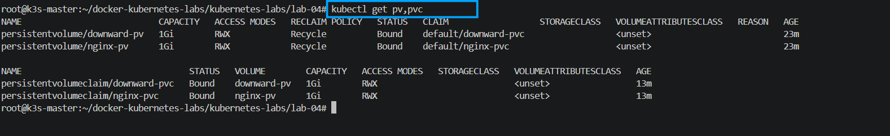
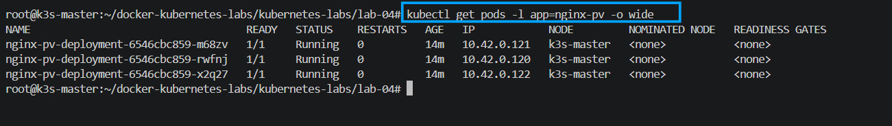
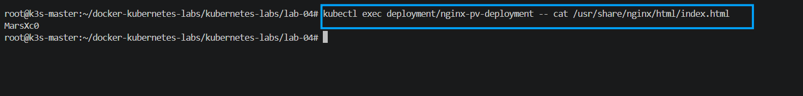
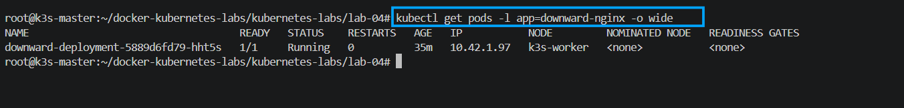
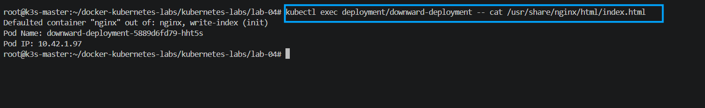
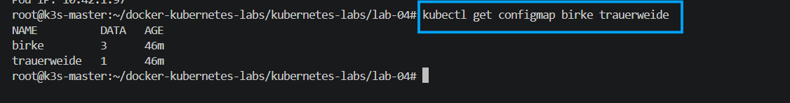
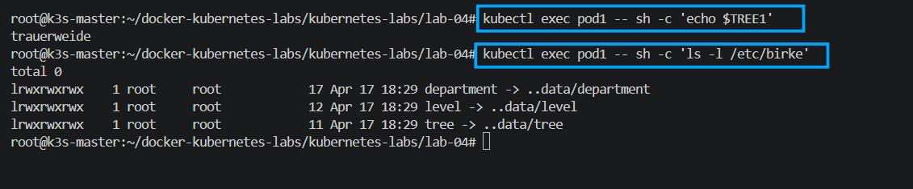

# Lab 04 - Persistent Volumes, Downward API, and ConfigMaps

This lab was implemented on the cluster and verified with running resources.

If you want a shorter manifest, use `lab-04-simple.yaml` (single file with all resources).

## 1) Persistent Volumes (5 points)

### 1.1 Create PV `nginx-pv` (hostPath, 1Gi, Recycle)

File: `pv-nginx.yaml`

```yaml
apiVersion: v1
kind: PersistentVolume
metadata:
  name: nginx-pv
spec:
  capacity:
    storage: 1Gi
  accessModes:
    - ReadWriteMany
  persistentVolumeReclaimPolicy: Recycle
  hostPath:
    path: /mnt/nginx-pv
```

### 1.2 Create PVC and bind it to `nginx-pv`

File: `pvc-nginx.yaml`

```yaml
apiVersion: v1
kind: PersistentVolumeClaim
metadata:
  name: nginx-pvc
spec:
  storageClassName: ""
  accessModes:
    - ReadWriteMany
  resources:
    requests:
      storage: 1Gi
  volumeName: nginx-pv
```

### 1.3 Create host file with full name and mount claim in deployment (3 replicas on same node)

Host command used:

```bash
sudo mkdir -p /mnt/nginx-pv
echo "MarsXc0" | sudo tee /mnt/nginx-pv/index.html
```

File: `deploy-nginx-pv.yaml`

```yaml
apiVersion: apps/v1
kind: Deployment
metadata:
  name: nginx-pv-deployment
spec:
  replicas: 3
  selector:
    matchLabels:
      app: nginx-pv
  template:
    metadata:
      labels:
        app: nginx-pv
    spec:
      nodeSelector:
        kubernetes.io/hostname: k3s-master
      containers:
      - name: nginx
        image: nginx:alpine
        volumeMounts:
        - name: nginx-storage
          mountPath: /usr/share/nginx/html
      volumes:
      - name: nginx-storage
        persistentVolumeClaim:
          claimName: nginx-pvc
```

Apply:

```bash
kubectl apply -f pv-nginx.yaml
kubectl apply -f pvc-nginx.yaml
kubectl apply -f deploy-nginx-pv.yaml
```

PoC:




## 1-b) Downward API with PV/PVC (5 points)

### 1.4 Create PV/PVC for downward task

Files: `pv-downward.yaml`, `pvc-downward.yaml`

```yaml
apiVersion: v1
kind: PersistentVolume
metadata:
  name: downward-pv
spec:
  capacity:
    storage: 1Gi
  accessModes:
    - ReadWriteMany
  persistentVolumeReclaimPolicy: Recycle
  hostPath:
    path: /mnt/downward-pv
```

```yaml
apiVersion: v1
kind: PersistentVolumeClaim
metadata:
  name: downward-pvc
spec:
  storageClassName: ""
  accessModes:
    - ReadWriteMany
  resources:
    requests:
      storage: 1Gi
  volumeName: downward-pv
```

### 1.5 Create deployment that writes podName and podIP to index.html

File: `deploy-downward.yaml`

```yaml
apiVersion: apps/v1
kind: Deployment
metadata:
  name: downward-deployment
spec:
  replicas: 1
  selector:
    matchLabels:
      app: downward-nginx
  template:
    metadata:
      labels:
        app: downward-nginx
    spec:
      initContainers:
      - name: write-index
        image: busybox:1.36
        command: ["sh", "-c"]
        args:
          - |
            echo "Pod Name: ${POD_NAME}" > /workdir/index.html
            echo "Pod IP: ${POD_IP}" >> /workdir/index.html
        env:
        - name: POD_NAME
          valueFrom:
            fieldRef:
              fieldPath: metadata.name
        - name: POD_IP
          valueFrom:
            fieldRef:
              fieldPath: status.podIP
        volumeMounts:
        - name: downward-storage
          mountPath: /workdir
      containers:
      - name: nginx
        image: nginx:alpine
        volumeMounts:
        - name: downward-storage
          mountPath: /usr/share/nginx/html
      volumes:
      - name: downward-storage
        persistentVolumeClaim:
          claimName: downward-pvc
```

Apply:

```bash
kubectl apply -f pv-downward.yaml
kubectl apply -f pvc-downward.yaml
kubectl apply -f deploy-downward.yaml
```

PoC:




## 2) ConfigMaps (10 points)

### 2.1 Create `/opt/cm.yaml`

```yaml
apiVersion: v1
data:
  tree: birke
  level: "3"
  department: park
kind: ConfigMap
metadata:
  name: birke
```

### 2.2 Create ConfigMap `trauerweide`

```bash
kubectl create configmap trauerweide --from-literal=tree=trauerweide
```

### 2.3 Create pod1 with env + mounted configmap files

File: `pod1.yaml`

```yaml
apiVersion: v1
kind: Pod
metadata:
  name: pod1
spec:
  containers:
  - name: nginx
    image: nginx:alpine
    env:
    - name: TREE1
      valueFrom:
        configMapKeyRef:
          name: trauerweide
          key: tree
    volumeMounts:
    - name: birke-volume
      mountPath: /etc/birke
  volumes:
  - name: birke-volume
    configMap:
      name: birke
```

Apply:

```bash
kubectl apply -f /opt/cm.yaml
kubectl apply -f pod1.yaml
```

Verify:

```bash
kubectl exec pod1 -- sh -c 'echo $TREE1'
kubectl exec pod1 -- sh -c 'ls -l /etc/birke'
kubectl exec pod1 -- sh -c 'for f in /etc/birke/*; do echo "--- $f"; cat "$f"; done'
```

PoC:




